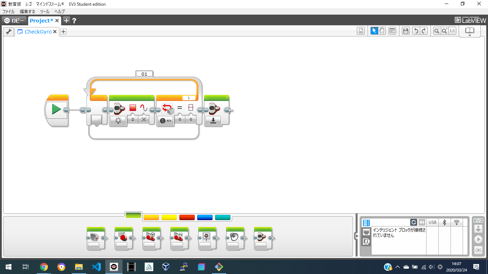

# CheckGyro

CheckGyroは、ジャイロがバグっている時警告するマイブロックである。

## 概要
>運動学において、角速度は、ある点をまわる回転運動の速度を、単位時間に進む角度によって表わした物理量である。言い換えれば角速度とは、原点と物体を結ぶ線分、すなわち動径が向く角度の時間変化量である。特に等速円運動する物体の角速度は、物体の速度を円の半径で割ったものとして与えられる。（[Wikipedia](https://ja.wikipedia.org/wiki/%E8%A7%92%E9%80%9F%E5%BA%A6)）

角速度の基準が通常は0なのに対し、ジャイロがバグっている時は角速度の基準が0ではないことを利用して、ジャイロがバグっている時はずっと赤く光ってループが終了しない。
## 直し方
ジャイロのケーブルを差しなおすことでジャイロのバグが直る。一部の環境では、ジャイロのモードを切り替えることでバグが直るという情報もあるが、詳細は不明。